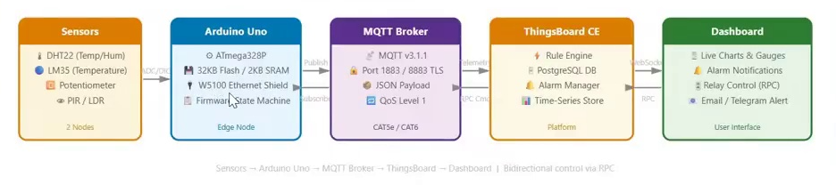
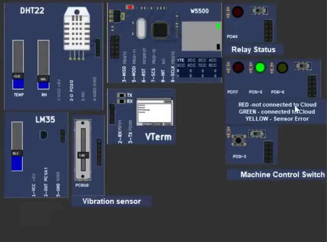
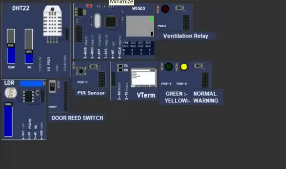
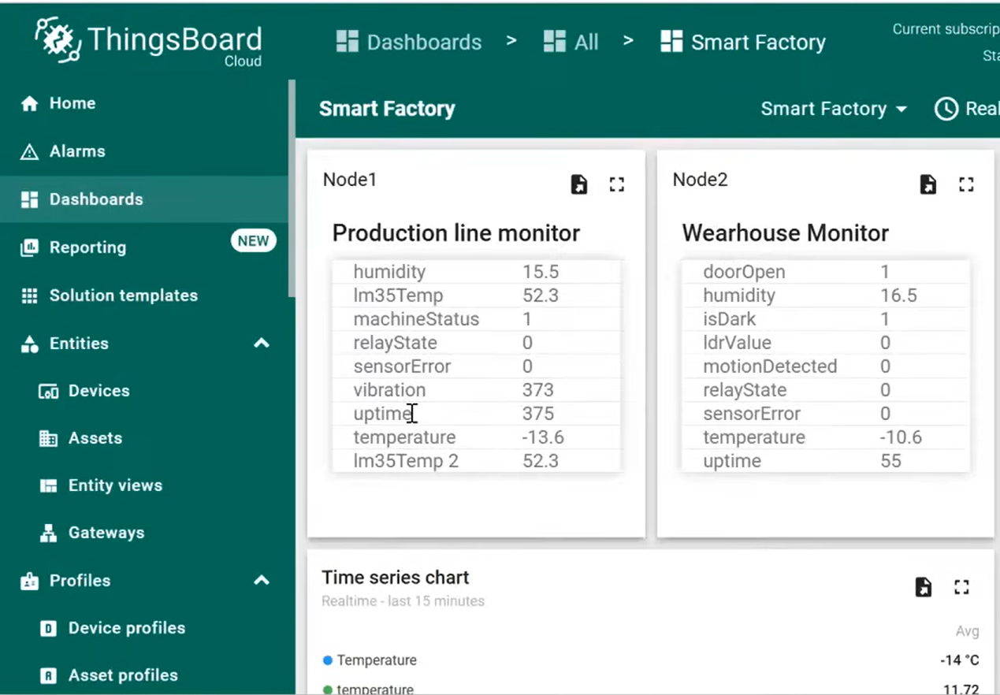
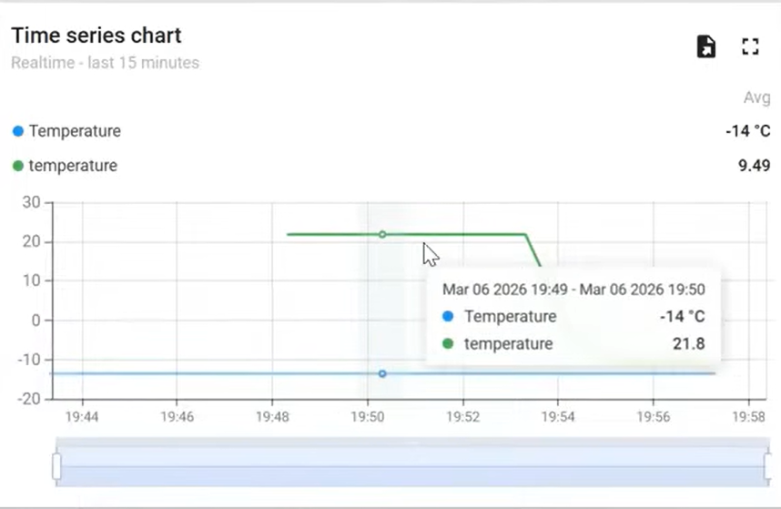
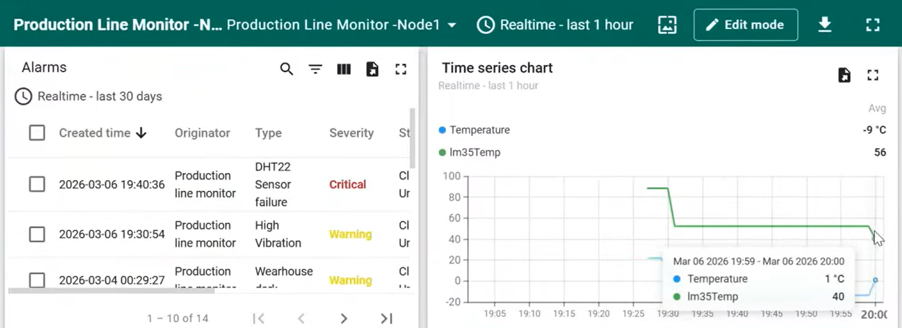
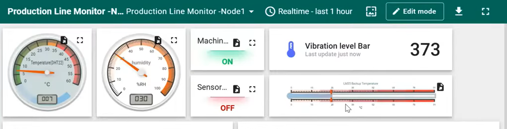

# Smart Factory IoT Monitoring System 🏭⚡

A complete, end-to-end Industrial Internet of Things (IIoT) monitoring and control system built using Arduino (C++), MQTT, and ThingsBoard. This project simulates a smart factory environment with real-time telemetry, automated actuators, and remote monitoring dashboards.

## 📋 Table of Contents
- [Project Overview](#project-overview)
- [System Architecture](#system-architecture)
- [Hardware & Sensors](#hardware--sensors)
- [Software Modules](#software-modules)
- [Features & Use Cases](#features--use-cases)
- [Getting Started](#getting-started)

---

## 🔍 Project Overview
Industrial facilities often lack real-time visibility, leading to delayed incident responses and reactive maintenance. This project solves that by deploying an **Arduino-based sensor network** that streams live environmental data (temperature, vibration, motion) directly to a **ThingsBoard Cloud** dashboard via **MQTT**. 

The system operates across two distinct simulated nodes:
1. **Node 1 (Production Line):** Monitors machine vitals, vibrations, and temperature.
2. **Node 2 (Warehouse):** Monitors ambient climate, security (motion/doors), and lighting.

---

## 🏗 System Architecture

The architecture follows a standard 4-layer IoT reference model:

1. **Perception (Edge):** Arduino Uno gathering analog and digital signals.
2. **Transport (Network):** Ethernet (W5100) communicating over MQTT v3.1.1 (JSON Payload).
3. **Processing (Platform):** ThingsBoard CE handling data storage, Rule Engine, and Alarm Management.
4. **Application (UI):** Live interactive web dashboard with RPC (Remote Procedure Call) support.

> **Data Flow:** Sensors → Arduino Uno → MQTT Broker → ThingsBoard → Dashboard | Bidirectional control via RPC

---

## 🔌 Hardware & Sensors

The project utilizes the following simulated hardware components:

### Node 1: Production Line

| Component | Pin | Function |
| :--- | :--- | :--- |
| **DHT22** | `D2` | Air temperature and humidity monitoring |
| **LM35** | `A1` | Machine surface temperature (Analog) |
| **Potentiometer**| `A0` | Simulates machine vibration (ADC average) |
| **Push Button** | `D3` | Machine ON/OFF state (Active LOW) |
| **Relay Module**| `D4` | Production equipment power control |
| **LEDs** | `D5, D6, D7`| Status indicators (Green=OK, Yellow=Warning, Red=Critical) |

### Node 2: Warehouse

| Component | Pin | Function |
| :--- | :--- | :--- |
| **DHT22** | `D2` | Ambient warehouse climate monitoring |
| **LDR** | `A0` | Light Dependent Resistor to detect darkness |
| **PIR Sensor** | `D3` | Motion detection for security |
| **Reed Switch** | `D7` | Door open/close detection |
| **Relay Module**| `D4` | Automated ventilation fan control |

---

## 💻 Software Modules

The embedded C++ code is highly modularized for maintainability and scalability:
- `SensorManager`: Reads raw ADC/digital values, computes engineering units, and applies de-bouncing.
- `ActuatorManager`: Controls relays and LEDs (steady and blink logic).
- `NetworkManager`: Handles Ethernet initialization, MQTT connections, and auto-reconnect loops.
- `TelemetryManager`: Serializes keys into compact JSON strings and publishes them.
- `RPCHandler`: Parses incoming RPC messages from ThingsBoard to trigger local actions (e.g., `setRelay`).

---

## 🚀 Features & Use Cases

- **Live Production Monitoring:** Real-time gauges for machine temperature and vibration. Alerts trigger if values enter critical red zones.
- **Automated Ventilation:** If warehouse humidity climbs above 85%, the system automatically energizes the ventilation relay without human intervention.
- **Remote Equipment Shutdown:** Managers can use the Dashboard RPC switches to instantly de-energize production relays in emergencies.
- **Security Monitoring:** Combines PIR motion logic (with a 10-second hold latch) and door reed switches to monitor after-hours access.
- **Fault Tolerance:** If a DHT22 sensor fails, the system detects the read error, caches the last valid values to prevent false alarms, and blinks a warning LED.

### 📊 Dashboard Screenshots

| | |
|:---:|:---:|
|  |  |
|  |  |

---

## 🛠 Getting Started

### Prerequisites
- [PicsimLab](https://lcgamboa.github.io/picsimlab/) (for hardware simulation)
- Arduino IDE (with `PubSubClient` and `DHT sensor library` installed)
- ThingsBoard Account (cloud.thingsboard.io or local CE instance)

### Setup Instructions
1. Clone this repository to your local machine.
2. Open the `node1_production.ino` and `node2_warehouse.ino` files in Arduino IDE.
3. Update `config.h` with your specific **ThingsBoard Access Tokens** and MQTT Broker details.
4. Compile and export the compiled binary (`.hex`).
5. Load the `.hex` file into your PicsimLab Uno workspace.
6. Configure your ThingsBoard dashboard to subscribe to `v1/devices/me/telemetry`.

---
*Built during the IoT Internship at Emertxe Information Technologies.*
